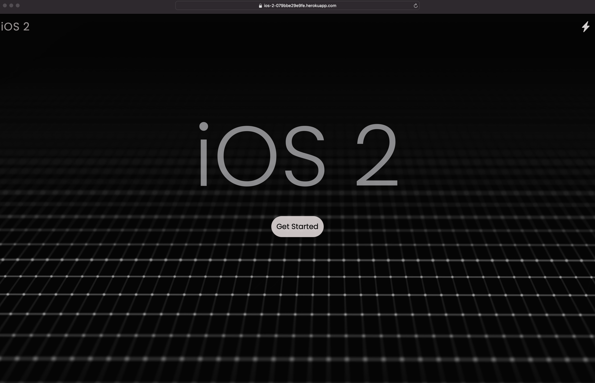
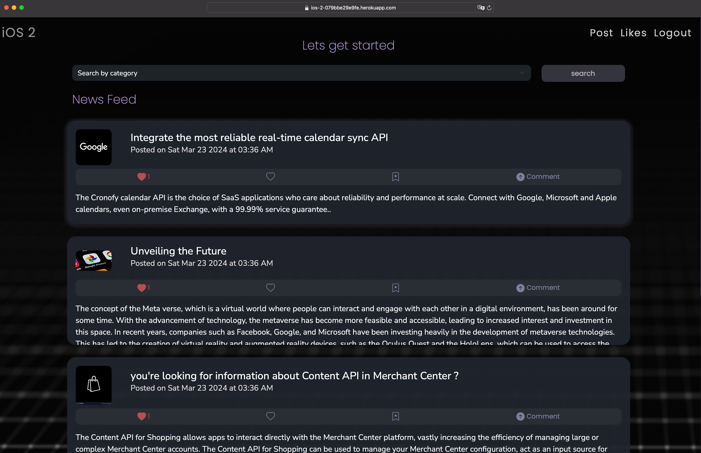
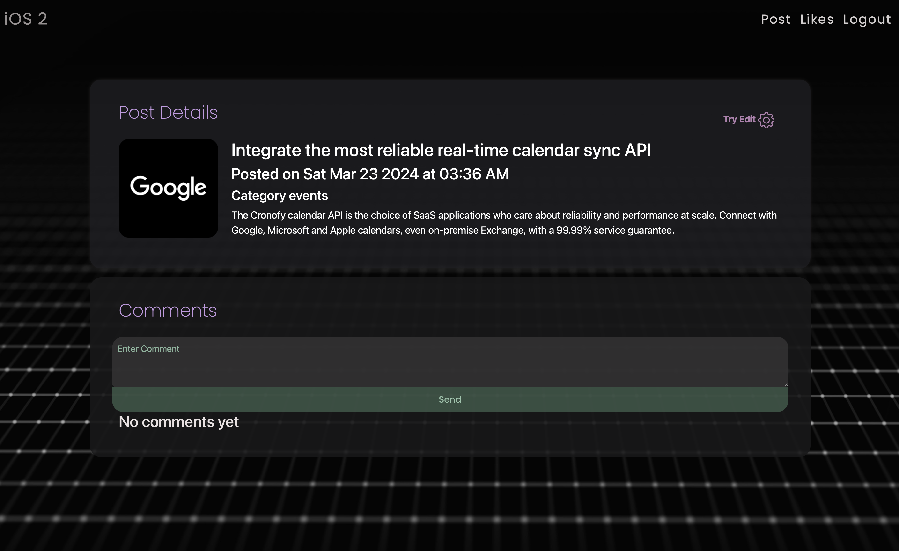
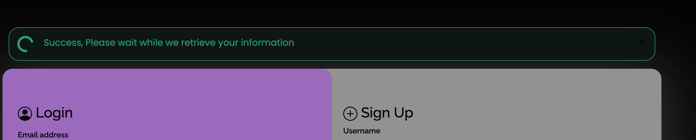
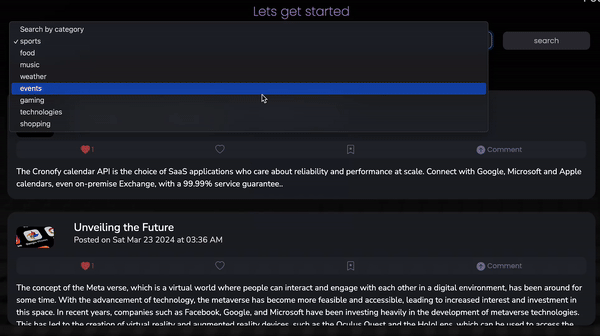
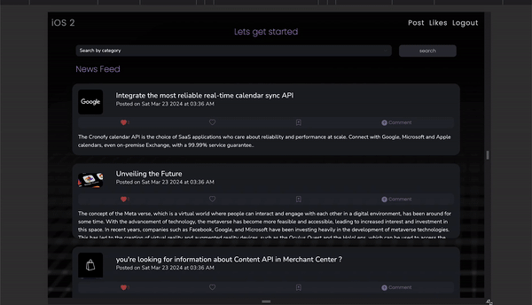
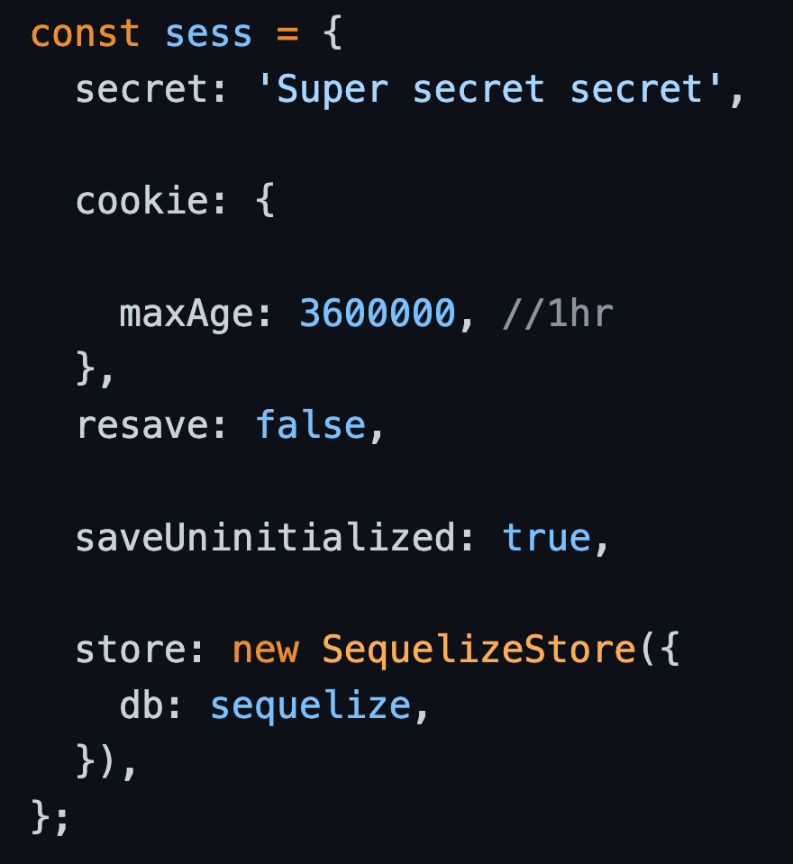
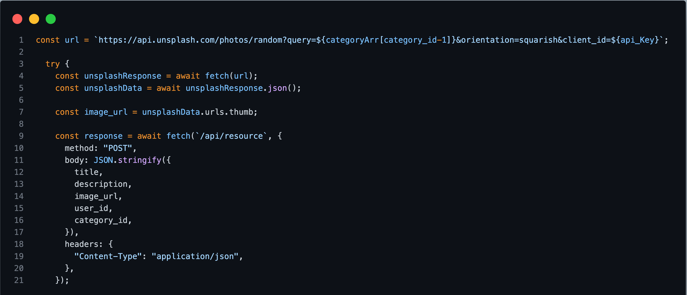

# iOS2 


#### Web Application:

[iOS2.com](https://ios-2-079bbe29e9fe.herokuapp.com/)


---
 ### Description:
iOS2 is an Blog post built to connect the world together over the net. It is a full-stack web application built using Node.js, Express.js, and MySQL, following the MVC paradigm to ensure a structured and maintainable codebase. It offers a secure and interactive platform with RESTful API endpoints for data retrieval and addition. The application employs Handlebars.js as the templating engine for dynamic content rendering.


----

#### Table of Contents:
  
 * [Installation](#installation)
 * [Usage](#usage)
 * [Highlighted Features](#highlighted-features)
 * [Learning Points](#learning-points)
* [Technologies Used](#technology-used)
 * [License](#license)
 * [Badges](#badges)
 * [Tests](#tests)
 * [Contributing](#contributing)
 * [Authors](#authors)
 * [Credits](#credit)


---


### Usage

Instruction to how this application work and it overall functionalities.

---

**Website Landing Page:** Jstudio wants to provides users with a streamlined experience to enter the iOS2 content within the site.




---

**New Feed:** At a glance the new feed will display all post within the database from the most relevant to the least by using some algorithm technique. 




---


**Post Detail:** In post detail user will see full post description and to the top right is the edit button, as it now we want the data to be able to editable by everyone so user has the freedom to free with the flow




---

**My Dashboard:** Each user has a dashboard, which can be accessed after logging in. Here user will be able to edit views their posts, make a new post or edit your post.


---

### Highlighted Features:

**Interactive Feature:** Throughout the website there are notification integrated to help let our user knows what going on and handling error events.




**RESTful API:** Utilizing Node.js and Express.js, the application provides both GET and POST routes to facilitate seamless interaction with the database.




**Database Integration:** MySQL is employed as the relational database, and Sequelize ORM streamlines data management, ensuring efficient and organized storage.

**Deployment on Heroku:** API Adventures is hosted on Heroku, ensuring accessibility and scalability. The deployment includes the necessary data, ensuring a fully functional application.

**Polished UI:** The user interface is thoughtfully designed, adhering to best practices in user experience. It ensures an intuitive and visually appealing interaction for users.

**Responsiveness:** The application is responsive, adapting seamlessly to various screen sizes and devices, providing an optimal user experience.


**Interactivity:** API Adventures engages users by accepting and responding to their inputs. It fosters dynamic interactions to enhance user engagement.

**MVC Folder Structure:** Following the MVC paradigm, the project maintains a well-organized folder structure. Models, views, and controllers are distinct and logically organized, promoting code maintainability.

**Authentication with Express-Session and Cookies:** User authentication is a priority, implemented using Express-session and cookies. This ensures secure access to user-specific data and actions.



**Environment Variable Security:** API keys and sensitive information are protected using environment variables, adding an extra layer of security to the application.


**Clean Repository:** The project repository adheres to quality coding standards. It demonstrates consistency in file structure, naming conventions, and follows best practices for class and ID naming, indentation, and includes high-quality comments for code documentation.

 **Random Photo Search Technology:** This application utilizes the Unsplash API to get a random photo and sets it as a Project or Resource category profile image.  The Unsplash API allows us to filter the searches and retrieve a random photo for the user and a search a topic related photo for the resource category.





---


#### Installation:
  
* First you open the application with VSCODE
* Then open the command line to install all dependencies, type
```
 run: npm install
```
* Create the database in MYSQL using the schema.sql file included in the db directory.
```
+-- root
|   +-- db
|       +-- schema.sql
+-- config
+-- controllers
+-- public

```
* run this script and paste everything in the schema.sql to create the basic structure for your MySQL database
```
mysql -u root -p
```
* then you get our data into your database you doing run this in the command line
``` 
run: npm run seed 
``` 
* To start the server, run: node server.js


## Technology Used:


[more detail](https://github.com/)


[more detail](https://www.heroku.com/platform)


[more detail](https://developer.mozilla.org/en-US/docs/Web/HTML)


[more detail](https://developer.mozilla.org/en-US/docs/Web/CSS)


[more detail](https://developer.mozilla.org/en-US/docs/Web/JavaScript)


[more detail](https://getbootstrap.com)


[more detail](https://www.npmjs.com/)


 [mysql2](https://www.npmjs.com/package/mysql2resource)
 
 [sequelize](https://sequelize.org/)
 
 [express](https://expressjs.com/)
 
 [express-handlebar](https://www.npmjs.com/package/express-handlebars)
 
 [express-session](https://www.npmjs.com/package/express-session)
 
 [dotenv](https://www.npmjs.com/package/dotenv)
 
 [handlebars](https://handlebarsjs.com/)
 
 [bcrypt](https://www.npmjs.com/package/bcrypt)
 
 [MVC](https://developer.mozilla.org/en-US/docs/Glossary/MVC)

[Unsplash API](https://unsplash.com/developers)


----


## Learning Points:
1. Handlebars.js: Gain proficiency in using Handlebars.js as a templating engine for dynamic content rendering. Understand its syntax and how it integrates with Node.js and Express.js.

2. MVC Paradigm: Implement the MVC (Model-View-Controller) paradigm to organize code efficiently, separating concerns and promoting maintainability.

3. Authentication: Implement user authentication using express-session and cookies to secure access to user-specific data and actions.

4. Deployment on Heroku: Understand the process of deploying a Node.js application on Heroku, including configuring environment variables and ensuring the deployment includes necessary data for a fully functional application.

5. Environment Variable Security: Learn to protect sensitive information, such as API keys, by using environment variables, adding an extra layer of security to the application.

6. Testing with Insomnia: Use tools like Insomnia for testing frontend and backend routes, ensuring proper functionality and identifying potential issues.


 ## Tests:
 
 This application tested the the front end and backend routes using Insomnia Core application

  
 
 ## Authors:
 Jay Nghiem

 - [Portfolio](https://jstudio.tech)
 - [LinkedIn](https://www.linkedin.com/in/thai-nghiem-319292267/)
 - [GitHub](https://github.com/Truecoding4life)


## Credit:

 Anna Rose Benedetti

 - [Portfolio](https://abenedetti27.github.io/Portfolio/)
 - [LinkedIn](https://www.linkedin.com/in/anna-rose-benedetti/)
 - [GitHub](https://github.com/abenedetti27)

 Armando Arujo

 - [Portfolio](https://armand57araujo.github.io/Portfolio/)
 - [LinkedIn](https://www.linkedin.com/in/armand-araujo-a82ba2291/)
 - [GitHub](https://armand57araujo.github.io/Portfolio/)


 Andy Zurek

 - [Portfolio](https://azurek17.github.io/zurek-portfolio/)
 - [LinkedIn](https://www.linkedin.com/in/andy-zurek-374bb9291/)
 - [GitHub](https://github.com/AZurek17)


## License:

 This project is licensed with MIT license

 Link to License - [Website to MIT License]((https://opensource.org/license/mit))
